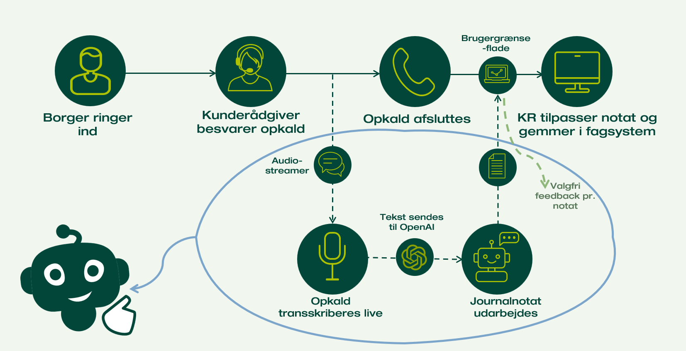

# Journalnotats-Assistent

Et AI-drevet system til automatisk optagelse, transskribering og generering af journalnotater fra telefonsamtaler mellem borgere og kunderådgivere. Fra opkald afsluttes til færdigt notat er klar hos kunderådgiveren tager det ca. **6 sekunder**.



> **Bemærk:** Dette repo er et udpluk af koden og er i nuværende stadie ikke fuldt funktionsdygtig, men mere en inspirationskilde til, hvordan sådan et system kan struktureres.

---

## Indholdsfortegnelse

- [System overblik](#system-overblik)
- [Komponenter](#komponenter)
- [Dataflow trin for trin](#dataflow-trin-for-trin)
- [Repo-struktur](#repo-struktur)
- [Opsætning og installation](#opsætning-og-installation)
- [Kørsel af tests](#kørsel-af-tests)
- [API-endepunkter](#api-endepunkter)
- [Nøglebegreber](#nøglebegreber)

---

## System overblik

Systemet starter automatisk, når en kunderådgiver modtager et opkald via Genesys (telefoniplatform). Det optager begge sider af samtalen separat, transskriberer lyden løbende via Azure OpenAI og genererer til sidst et struktureret journalnotat med GPT-4o — alt dette uden manuel indgriben.

**Overordnet flow:**

```
Borger ringer ind
      |
      v
Kunderådgiver besvarer opkald  <-- Genesys starter audio_streamer.exe
      |
      v
[Audio Streamer]
  - Optager mikrofon (agent) og højttaler (borger) i separate tråde
  - Transskriberer lyd i 30-sekunders chunks via Azure OpenAI (gpt-4o-mini-transcribe)
  - Uploader transskriptioner som JSONL til Azure Blob Storage
      |
      v
Opkald afsluttes  --> audio_streamer kalder /process_call hos Leverance
      |
      v
[Leverance - Flask API]
  - Henter og sorterer transskriptioner fra Azure Blob
  - Genererer journalnotat via GPT-4o (generér + validér)
  - Gemmer notat i SQL Server (jn.notat)
  - Sender "end-summary" til Azure Queue (status-{agent_id})
  - Gemmer samtale i SQL Server (jn.samtale)
      |
      v
[Frontend - Vue 3]
  - Poller /fetch_status kontinuerligt
  - Henter notat via /get_notat når "end-summary" modtages
  - Viser notatet til kunderådgiveren
```

---

## Komponenter

### Audio Streamer

`audio_streamer/` er en Windows desktop-applikation, der kompileres til en `.exe`-fil. Genesys starter den automatisk ved indkommende opkald med følgende argumenter:

```
audio_streamer.exe /startRecording AgentID=<initialer> CallID=<id> Queue=<kø> CPR=<cpr>
```

**Hvad den gør:**

Klassen `SimpleRecordingManager` i `streamer.py` starter to optagelsestråde — én til mikrofonen (kunderådgiveren) og én til højttaleren (borgeren via WASAPI loopback). Lyden buffers og sendes til `AzureOpenAITranscriber`, der batcher den i chunks på mindst 30 sekunder og sender dem til `gpt-4o-mini-transcribe` for transskribering. Resultaterne gemmes i hukommelsen med tidsstempel og uploades til sidst som JSONL til Azure Blob Storage.

Optagelsens livscyklus styres via en flag-fil (`~/simple-flag-{AgentID}.txt`). Genesys fjerner filen, når opkaldet afsluttes, og det udløser hele nedlukningssekvensen.

**To driftstilstande** (konfigureres per agent i `jn.config` via `streamer_version`):

| Tilstand | Beskrivelse |
|----------|-------------|
| `openai` (standard) | Lyd transskriberes lokalt og uploades som JSONL til Blob. Leverance notificeres, når det er klar. |
| `azure` | Rå lydchunks uploades direkte til Blob til server-side transskribering. |

**Centrale filer:**

| Fil | Ansvar |
|-----|--------|
| `streamer.py` | Hovedindgang. Styrer optagelse, konfigurationshentning og koordinerer hele flowet. |
| `openai_transcriber.py` | Bufferer lyd, sender til Azure OpenAI og uploader JSONL til Blob. |
| `azure_storage.py` | Direkte upload af rå lydfiler til Blob (bruges i `azure`-tilstand). |
| `config.py` | Konfigurationsklasser for `dev`- og `prod`-miljøer. |
| `tray_icon.py` | Windows systembakkeikon, så kunderådgiver kan følge optagelsesstatus. |

---

### Leverance

`leverance/` er en Flask-baseret REST API, der modtager notifikation fra `audio_streamer`, orkestrerer GPT-genereringen og leverer data til frontenden.

**Business components** (`leverance/components/business/jn/`):

| Komponent | Ansvar |
|-----------|--------|
| `JNControllerBusinessComponent` | Henter og sorterer transskriptioner fra Azure Blob (`read_and_sort_messages`). Sender statussignaler til Azure Queue. |
| `JNModelBusinessComponent` | Orkestrerer GPT-kaldene. Henter prompts fra DB, sender samtalen til GPT-4o (generér + validér) og formaterer output til HTML. |
| `JNNotatBusinessComponent` | Gemmer og henter journalnotater i `jn.notat`. |
| `JNSamtaleBusinessComponent` | Gemmer den transskriberede samtale i `jn.samtale`. |
| `JNPromptsBusinessComponent` | Henter versionstyrede prompts fra `jn.prompts` baseret på agent og forretningsområde. |
| `JNConfigBusinessComponent` | Henter og administrerer per-agent konfiguration fra `jn.config`. |
| `JNStorageAccountBusinessComponent` | Opretter Azure Blob/Queue klienter og udsteder midlertidige storage-tokens. |
| `JNNotatFeedbackBusinessComponent` | Gemmer kunderådgivers feedback (rating + kommentar) i `jn.notat_feedback`. |

**Notatgenerering sker i to GPT-trin:**

1. **Generering** (`sekvens_nr=1`): Samtalen + genereringsprompt sendes til GPT-4o, der returnerer et journalnotat i JSON-format med felterne `oplysninger` og `status`.
2. **Validering** (`sekvens_nr=2`): Det genererede notat sendes igennem en valideringsprompt for kvalitetssikring og konsistens.

Notatet formateres derefter til HTML og gemmes i `jn.notat`.

**Prompt-versionstyring:** Prompts hentes fra `jn.prompts`-tabellen med `sekvens_nr` og `ordning` (forretningsområde). Systemet falder tilbage til `standard`-prompts, hvis der ikke findes en specifik prompt for agentens forretningsområde.

---

### AIService

`aiservice/` er en intern SDK-pakke, der wrapper kommunikationen med Azure OpenAI. Den er udviklet for modulært at kunne understøtte skift af model eller framework i takt med at LLM-verden udvikler sig.

`OpenAIAssistant` understøtter chat completions (`prompt`) og embeddings (`embed`) og har mock-metoder til brug i unit tests.

---

### Frontend (fe/)

`fe/` er en Vue 3 + Pinia SPA skrevet i TypeScript. Den poller Leverance for opkaldsstatus og viser det genererede journalnotat til kunderådgiveren.

**Tre views:**

| Route | View | Formål |
|-------|------|--------|
| `/` | `JNNotatView` | Hoved-visning med statusbar, notat, kopier-knap og feedback |
| `/config` | `JNConfigView` | Per-agent konfiguration (streamer-version, model, miljø) |
| `/notat_overblik` | `JNNotatOverblikView` | Supervisor-overblik over alle genererede notater |

**Polling-logik (`JNJournalnotatStore.ts`):**

Frontenden poller `/fetch_status` med et adaptivt interval for at minimere ventetiden uden at overbelaste serveren:

| Situation | Interval |
|-----------|----------|
| Lige efter `end-call` (første 20s) | Hvert 2. sekund |
| Normalt | Hvert 10. sekund |
| Efter 15 min uden statusændring | Hvert minut |
| Efter 30 min | Stopper og informerer brugeren |

**Statusflow:**

```
(ingen) --> start-call --> end-call --> end-summary
                                            |
                                      Henter notat og viser til KR
```

---

## Dataflow trin for trin

```
1.  Genesys starter audio_streamer.exe med AgentID, CallID, Queue, CPR

2.  audio_streamer henter agent-konfiguration: GET /get_config
    --> bestemmer streamer_version og controller_version

3.  To optagelsestråde starter:
    - MicrophoneRecorder (agent)   -->  agent_queue
    - SpeakerRecorder (borger)     -->  caller_queue

4.  To transcriberingstråde starter:
    - AzureOpenAITranscriber(agent)  -- bufferer og sender til gpt-4o-mini-transcribe hvert 30s
    - AzureOpenAITranscriber(caller) -- samme for borgeren

    Ved opkaldsstart sendes "start-call" til Azure Queue: status-{agent_id}

5.  Opkald afsluttes -- Genesys sletter flag-filen
    stop_event sættes, tråde afsluttes

6.  AzureOpenAITranscriber.finalize():
    - Transskriberer resterende lyd
    - Uploader JSONL til Azure Blob: transcriptions-{call_id}-{speaker}.jsonl
    Sender "end-call" til Azure Queue: status-{agent_id}

7.  audio_streamer kalder: GET /process_call?call_id={call_id}

8.  Leverance /process_call:
    a. read_and_sort_messages(call_id)
       - Downloader og sletter begge JSONL-blobs (agent + borger)
       - Sorterer sætninger kronologisk efter timestamp
       - Returnerer agent_id, koe_id, cpr, samtale[]

    b. model.predict(samtale, call_id, agent_id)
       - Henter agent-konfiguration og forretningsområde
       - Henter prompts fra jn.prompts
       - GPT-kald 1: Genererer råt journalnotat
       - GPT-kald 2: Validerer og kvalitetssikrer notatet
       - Formaterer til HTML (oplysninger + status + stempel)

    c. gem_notat() --> gemmer i jn.notat

    d. azure_notify_status("end-summary")
       --> sender til Azure Queue: status-{agent_id}

    e. gem_samtale() --> gemmer i jn.samtale

9.  Frontend poller /fetch_status og modtager "end-summary"
    --> kalder GET /get_notat
    --> viser HTML-notat til kunderådgiver

10. Kunderådgiver kopierer notat, giver feedback og gemmer i fagsystemet
```

---

## Repo-struktur

```
jn-assistent/
├── audio_streamer/          # Windows desktop-app (Python -> .exe)
│   ├── streamer.py          # Hovedindgang og optagelsesmanager
│   ├── openai_transcriber.py # Transskribering + Blob upload
│   ├── azure_storage.py     # Direkte Azure Blob upload (azure-tilstand)
│   ├── config.py            # Miljøkonfiguration (dev/prod)
│   └── tray_icon.py         # Windows systembakkeikon
│
├── leverance/               # Flask REST API
│   ├── interaction/         # HTTP-routes (Flask blueprints)
│   ├── components/
│   │   ├── business/jn/     # Forretningslogik (business components)
│   │   └── functions/       # Tekst-processor og LLM-hjælpere
│   ├── common/              # Azure-autentificeringshjælpere
│   ├── prompt/              # DB-migrationer (Alembic)
│   └── evaluation/          # Notatevaluering og diagnostik
│
├── aiservice/               # Azure OpenAI SDK-wrapper
│   ├── openai_assistant.py  # OpenAIAssistant klasse
│   ├── authentication.py    # Azure autentificering
│   └── core_functions.py    # Hjælpefunktioner
│
├── fe/                      # Vue 3 frontend
│   ├── stores/
│   │   ├── JNJournalnotatStore.ts  # Statuspolling og notat-hentning
│   │   ├── JNNotatOverblik.ts      # Supervisor-overblik
│   │   └── JNapi.ts                # Centraliserede API-kald
│   ├── routes.ts            # Vue Router konfiguration
│   └── types/               # TypeScript type-definitioner
│
├── tests/                   # Unit tests og end-to-end tests
│   ├── test_audio_streamer.py
│   └── end_to_end_and_load_test/
│
├── pyproject.toml           # PDM workspace-konfiguration
└── pdm.lock                 # Låste afhængigheder
```

---

## Opsætning og installation

### Forudsætninger

- Python 3.12+
- [PDM](https://pdm-project.org/) til pakkemanagement
- Node.js til frontend
- Azure-credentials (se nedenfor)

### Backend

```bash
# Installer alle pakker i editable mode fra repo-roden
pdm install
```

### Miljøvariable

Opret en `.env`-fil til `audio_streamer`:

```env
AZURE_TENANT_ID=<din-tenant-id>
AZURE_CLIENT_ID=<din-client-id>
AZURE_CLIENT_SECRET=<din-client-secret>
LEVERANCE_PASSWORD=<leverance-basic-auth-password>
LEVERANCE_URL=https://<leverance-host>
BLOB_ACCOUNT_URL=https://<storage-account>.blob.core.windows.net
QUEUE_ACCOUNT_URL=https://<storage-account>.queue.core.windows.net
AZURE_OPENAI_ENDPOINT=https://<openai-resource>.openai.azure.com
```

I `dev`-miljø bruges `DefaultAzureCredential` (fx via `az login`). I `prod` bruges `ClientSecretCredential` med ovenstående variabler.

### Frontend

```bash
cd fe
npm install
npm run dev
```

---

## Kørsel af tests

```bash
# Kør alle tests
pdm run pytest

# Kør en specifik business component test
pdm run pytest leverance/components/business/jn/_test_jn_controller_business_component.py

# Kør en specifik testklasse
pdm run pytest leverance/components/business/jn/_test_jn_notat_business_component.py::TestJNNotatBusinessComponent

# Kør audio_streamer unit tests
pdm run pytest tests/test_audio_streamer.py
```

**Kendte begrænsninger:**
- `tests/test_audio_streamer.py` kræver Windows (`win32gui`) — fejler på Linux
- `leverance/components/business/jn/_test_*.py` kræver den eksterne `leverance`-framework — se `PROGRESS.md` for status
- End-to-end og load tests kræver Azure-credentials i `.env`

---

## API-endepunkter

Alle endepunkter eksponeres af Leverance:

| Method | Endepunkt | Beskrivelse |
|--------|-----------|-------------|
| `GET` | `/process_call?call_id=<id>` | Kaldes af audio_streamer. Henter transskriptioner, genererer og gemmer journalnotat. |
| `GET` | `/fetch_status?kr_initialer=<initialer>` | Henter seneste opkaldsstatus fra Azure Queue (`start-call`, `end-call`, `end-summary`). |
| `GET` | `/get_notat?kr_initialer=<initialer>[&call_id=<id>]` | Henter seneste (eller specifikt) journalnotat fra `jn.notat`. |
| `POST` | `/feedback` | Gemmer kunderådgivers feedback (rating, kommentar, benyttet) i `jn.notat_feedback`. |
| `GET` | `/get_config?kr_initialer=<initialer>` | Henter agent-konfiguration fra `jn.config`. |
| `POST` | `/insert_config` | Indsætter eller opdaterer agent-konfiguration. |
| `GET` | `/delete_config?kr_initialer=<initialer>` | Sletter agent-konfiguration. |
| `GET` | `/sta_credentials` | Udsteder midlertidigt Azure Storage-token til audio_streamer. |
| `GET` | `/get_prompt?forretningsomraade=<ordning>` | Henter prompts for et givet forretningsområde. |

---

## Nøglebegreber

| Begreb | Forklaring |
|--------|------------|
| **Kunderådgiver (KR)** | ATP-medarbejder der besvarer opkaldet. Identificeres ved initialer (fx `ABC`). |
| **Borger** | Den borger der ringer ind. Betegnes `caller` i koden. |
| **Journalnotat** | Det strukturerede referat af samtalen, som kunderådgiveren gemmer i fagsystemet. |
| **Samtale** | Den komplette transskriberede dialog sorteret kronologisk. |
| **Forretningsområde / Ordning** | Faglig kategori (fx `pension`, `barsel`) der bestemmer hvilke GPT-prompts der bruges. |
| **CallID** | Unikt ID for hvert opkald, sammensat af Genesys-CallID + AgentID. |
| **Flag-fil** | Midlertidig fil (`~/simple-flag-{AgentID}.txt`) der signalerer at optagelse er aktiv. Slettes af Genesys ved opkaldsafslutning. |
| **Azure Queue** | `status-{kr_initialer}` — bruges til at signalere opkaldsstatus til frontenden. |
| **Azure Blob** | `transcriptions`-containeren — midlertidig opbevaring af JSONL-transskriptioner. |
