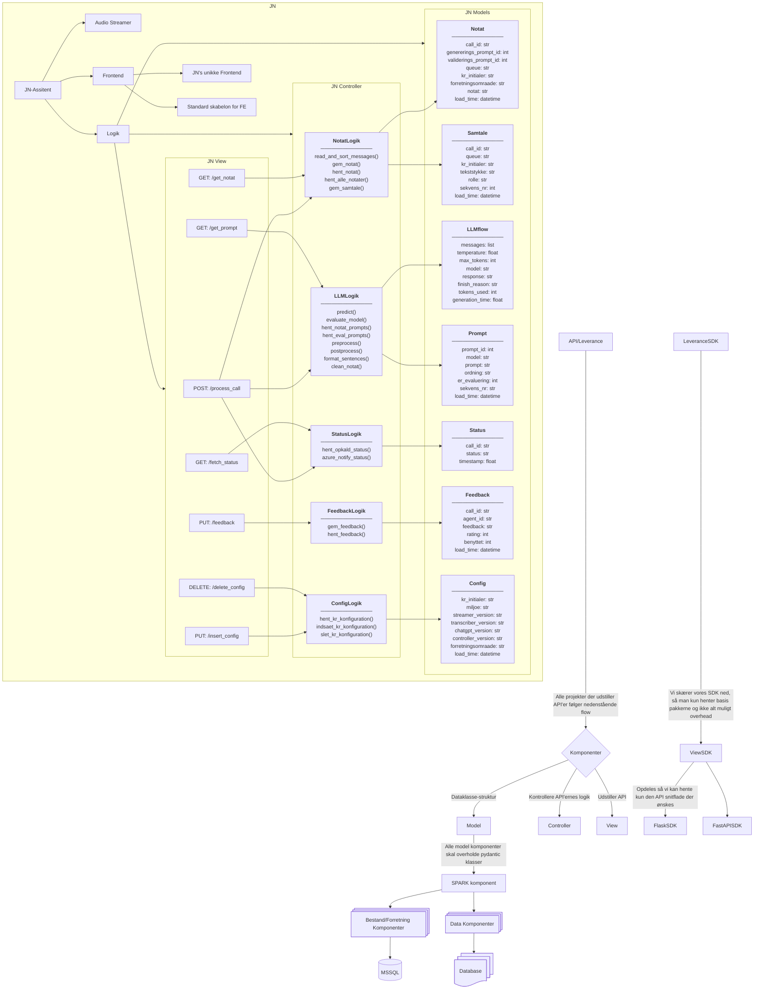

# JN-Assistent — Ny Leverance-arkitektur

```mermaid
flowchart TD
    A[API/Leverance] -->|Alle projekter der udstiller API'er følger nedenstående flow| B{Komponenter}
    B -->|Dataklasse-struktur| C[Model]
    C -->|Alle model komponenter skal overholde pydantic klasser| D[SPARK komponent]
    D --> Bestand@{ shape: st-rect, label: "Bestand/Forretning Komponenter" }
    Bestand --> DB@{ shape: cyl, label: "MSSQL" }
    D --> DataKomponenter@{ shape: st-rect, label: "Data Komponenter" }
    DataKomponenter --> Databaser@{ shape: docs, label: "Database" }

    B -->|Kontrollere API'ernes logik| Controller
    B -->|Udstiller API| View


    LeveranceSDK --> |Vi skærer vores SDK ned, så man kun henter basis pakkerne og ikke alt muligt overhead| ViewSDK
    ViewSDK --> |Opdeles så vi kan hente kun den API snitflade der ønskes| FlaskSDK
    ViewSDK --> FastAPISDK

    subgraph JN
        %% Arkitektur for JN i nyt monorepo setup
        JAN[JN-Assitent] --> AS[Audio Streamer]
        JAN --> JNC[Logik]
        JAN --> FE[Frontend]

        subgraph viewJAN[JN View]
            pcall[POST: /process_call]
            fstatus[GET: /fetch_status]
            gnotat[GET: /get_notat]
            pfeedback[PUT: /feedback]
            gprompt[GET: /get_prompt]
            iconfig[PUT: /insert_config]
            dconfig[DELETE: /delete_config]
        end

        subgraph controllerJAN[JN Controller]
            notatLogik["<b>NotatLogik</b><br>──────────────<br>read_and_sort_messages()<br>gem_notat()<br>hent_notat()<br>hent_alle_notater()<br>gem_samtale()"]
            LLMLogik["<b>LLMLogik</b><br>──────────────<br>predict()<br>evaluate_model()<br>hent_notat_prompts()<br>hent_eval_prompts()<br>preprocess()<br>postprocess()<br>format_sentences()<br>clean_notat()"]
            statusLogik["<b>StatusLogik</b><br>──────────────<br>hent_opkald_status()<br>azure_notify_status()"]
            feedbackLogik["<b>FeedbackLogik</b><br>──────────────<br>gem_feedback()<br>hent_feedback()"]
            configLogik["<b>ConfigLogik</b><br>──────────────<br>hent_kr_konfiguration()<br>indsaet_kr_konfiguration()<br>slet_kr_konfiguration()"]
        end

        subgraph modelJAN[JN Models]
            notat["<b>Notat</b><br>──────────────<br>call_id: str<br>genererings_prompt_id: int<br>validerings_prompt_id: int<br>queue: str<br>kr_initialer: str<br>forretningsomraade: str<br>notat: str<br>load_time: datetime"]
            samtale["<b>Samtale</b><br>──────────────<br>call_id: str<br>queue: str<br>kr_initialer: str<br>tekststykke: str<br>rolle: str<br>sekvens_nr: int<br>load_time: datetime"]
            feedback["<b>Feedback</b><br>──────────────<br>call_id: str<br>agent_id: str<br>feedback: str<br>rating: int<br>benyttet: int<br>load_time: datetime"]
            prompt["<b>Prompt</b><br>──────────────<br>prompt_id: int<br>model: str<br>prompt: str<br>ordning: str<br>er_evaluering: int<br>sekvens_nr: str<br>load_time: datetime"]
            LLMflow["<b>LLMflow</b><br>──────────────<br>messages: list<br>temperature: float<br>max_tokens: int<br>model: str<br>response: str<br>finish_reason: str<br>tokens_used: int<br>generation_time: float"]
            config["<b>Config</b><br>──────────────<br>kr_initialer: str<br>miljoe: str<br>streamer_version: str<br>transcriber_version: str<br>chatgpt_version: str<br>controller_version: str<br>forretningsomraade: str<br>load_time: datetime"]
            status["<b>Status</b><br>──────────────<br>call_id: str<br>status: str<br>timestamp: float"]
        end

        %% View til Controller
        pcall --> notatLogik
        pcall --> LLMLogik
        pcall --> statusLogik
        fstatus --> statusLogik
        gnotat --> notatLogik
        pfeedback --> feedbackLogik
        gprompt --> LLMLogik
        iconfig --> configLogik
        dconfig --> configLogik

        %% Controller til Model
        notatLogik --> notat
        notatLogik --> samtale
        LLMLogik --> LLMflow
        LLMLogik --> prompt
        statusLogik --> status
        feedbackLogik --> feedback
        configLogik --> config

        JNC --> viewJAN
        JNC --> controllerJAN
        JNC --> modelJAN

        FE --> FEJN[JN's unikke Frontend]
        FE --> FESDK[Standard skabelon for FE]
    end
```
